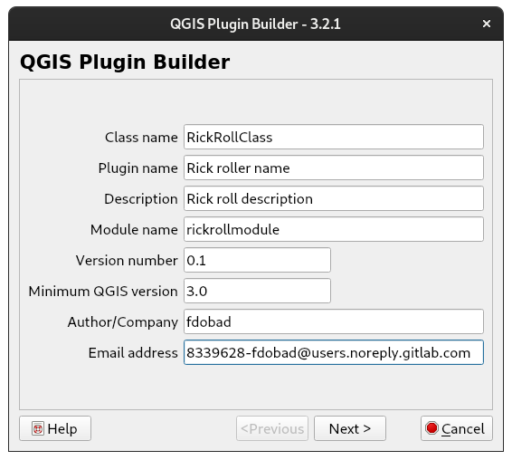
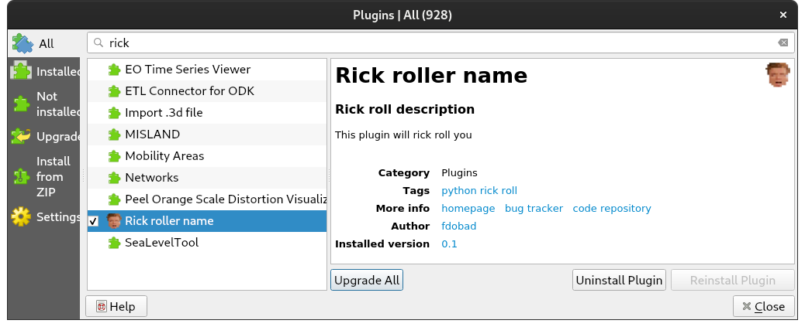

# qgis-pluginbuilder-minimalresult

This repo automates the push to release of a QGIS plugin.  
- So it can be installed as the released.zip:  
`QGIS > Menu > Plugins > Manage and Install Plugins... > Install from ZIP > choose release.zip`  
- Or be served by a qgis-plugin-server:  
`QGIS > Menu > Plugins > Manage and Install Plugins... > Settings > Add ... > URL http://yourpluginserver/plugin.xml`

# steps
1. [Install QGIS](https://qgis.org/en/site/forusers/download.html)

2. [Install plugin builder](https://plugins.qgis.org/plugins/pluginbuilder3)

3. Run plugin builder to make the simplest plugin, each form is filled with:


  
4. Then display a web page adding [QWebEngineView](https://www.riverbankcomputing.com/static/Docs/PyQt5/api/qtwebenginewidgets/qwebengineview.html?highlight=qweb#QWebEngineView) through QtDesigner to the dialog. Plus a minor interaction... Check the last lines of [module.py](rickrollmodule/rickrollmodule.py)

6. Add the github action that zips and releases it

7. Manage tags, to create a release when a new tag is pushed
```
# create tag
git tag -a v0.1 -m 'action test'

# delete local tag 
git tag --delete v0.1
# delete remote 
git push --delete origin v0.1

# push single
git push origin v0.1
# push all tags
git push origin --tags
```

